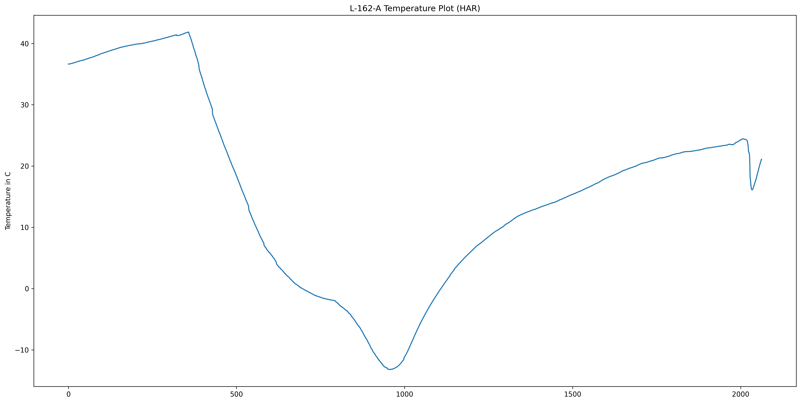
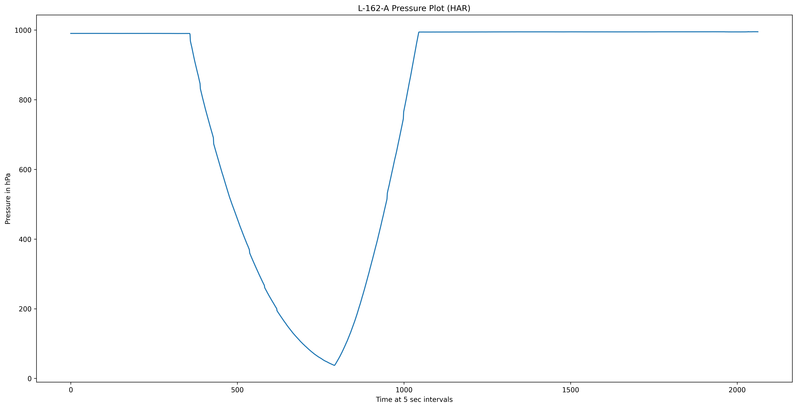
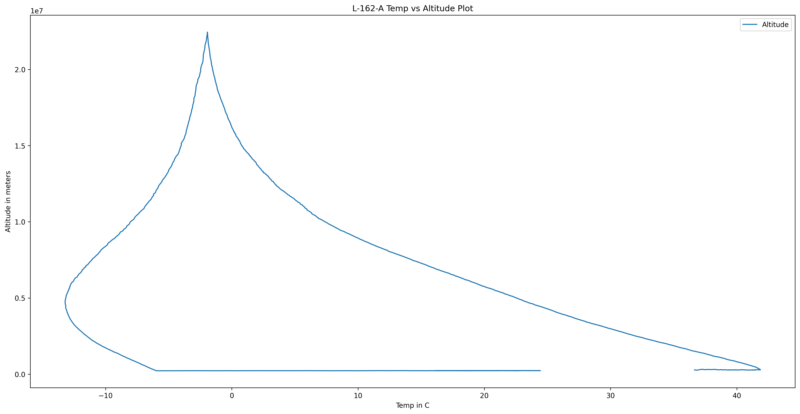
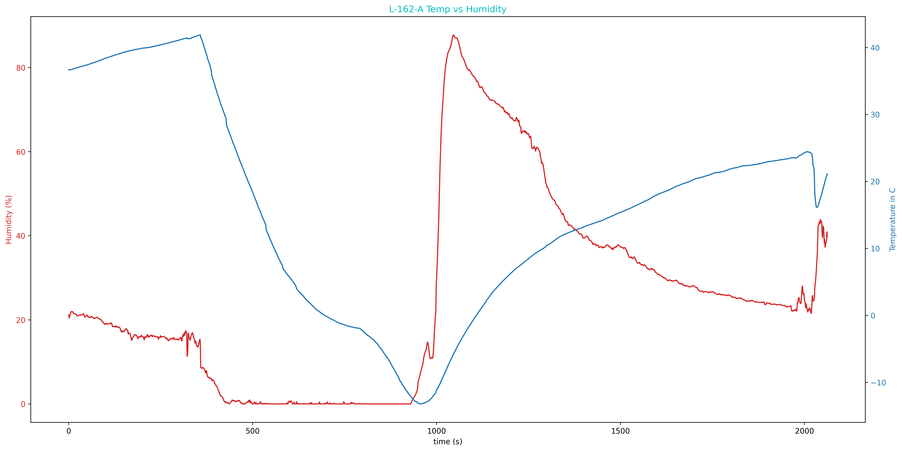
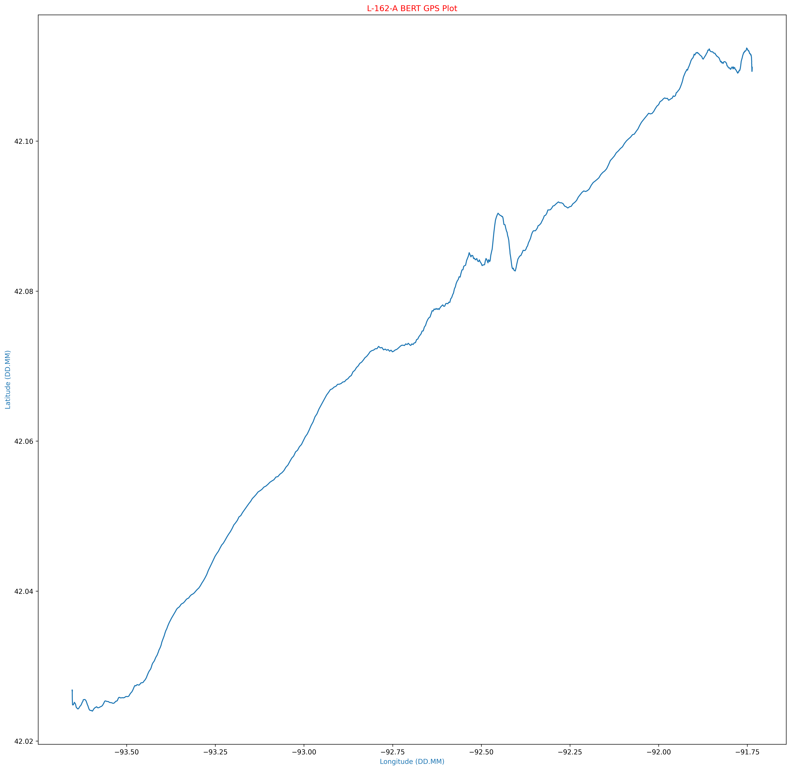
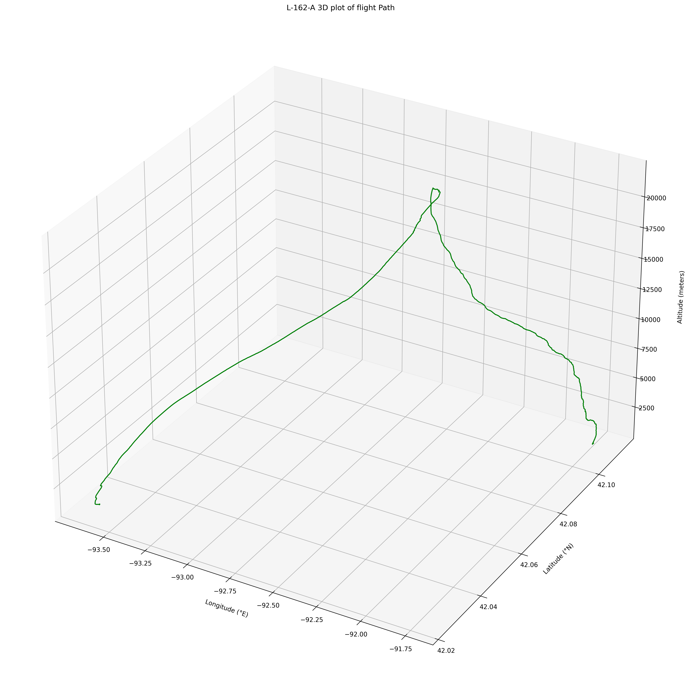

# Mission-162
Mission 162 Flights

## Mission
HABET Mission 162 is assigned to support the flights for the joint operation between the University of Iowa and Iowa State University. These flights are coordinating with a Near Space Payloads class being taught at the University of Iowa and the Make to Innovate and HABET program at ISU.

## Flight information
### HABET Flight L-162-A
Launched December 7th at 12:11 p.m. from Howe Hall in Ames, IA

### Spacecraft
The Gemini II spacecrafts were used

### Payloads
Coming soon

# Data Collected

## BERT Data
While BERT did transmit information, it was sporadic. However, the vital landing information was transmitted. BERT did NOT record data, the file had zero bytes. The cause is unknown at this time

## HAR Data
HAR Data was collected. HAR failed to transmit to Mission Control around 22K feet. This is being investigated but part of the problem seems to be with the pointing system for the antenna.

### Atmospheric Data
Below is the temperature data recorded. This was recorded with the onboard temperature since located on the Clue board. This board was located in the spacecraft.

  Below is the Humidity Data recorded

  

Below is the Pressure Sensor data recorded. This was in a partially sealed case.
  

Temperature data compared to the altitude as recorded by the GPS.

  

Temperature and Humidity Plot

### GPS Data

The following graphs are generated from the onboard GPS Unit. This includes Lat/Lon and Altitude data. We also plot this on a map using Tilemaps in Python.

We have confirmed that we have valid GPS data, so we can overlay this information using Tilemaps and Open Street Maps.

The following is now zooming into the landing spot on the map
  

### IMU Data
Since BERT malfunctioned, no IMU data was collected.

# Wrap up
Additional plots can be found in the Plots directory. You can find a KML file in the KML directory. Finally, the raw CSV file can be found in the Data folder.